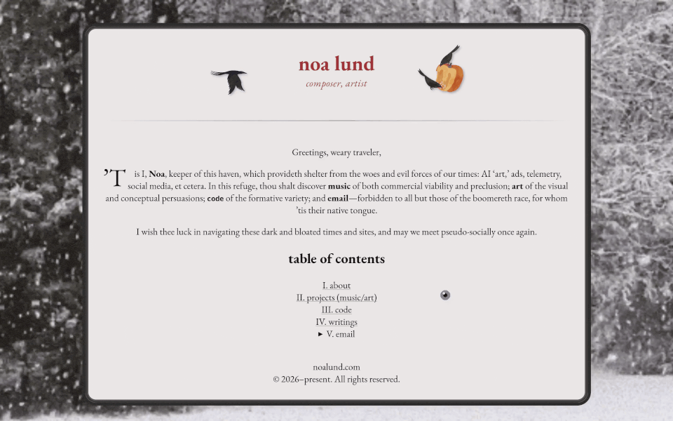

# Noa’s Website

This is my personal website, where I host music and art projects, amongst other things.
The design is inspired by the simplicity and aesthetics of static websites from the ’90s.
The modern web is characterized by stylistic homogeneity, commercialism, dependence on social media, and bloat.
I prefer HTML/CSS websites which are personable, creative, and destinations in their own right.
